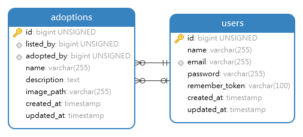

# Assignment 2: Pet Shelter
Assignment used for the course 'Web Technologies' at SDU. Developed using Laravel and Blade. It is developed using MVC pattern.

The pet shelter board is an application where registered users can post pets they are giving in for adoption. Moreover, registered users can also adopt pets posted by other users.

## Setup

1. Clone your project locally.
2. Run `composer install` to install php dependencies.
3. Create a copy of the .env.example file named .env. This can be done with the command `cp .env.example .env`
4. Run `php artisan key:generate` to generate a random encryption key for your application
5. Run `php artisan serve` to boot up your application

### The project

In this assignment, you are given an already coded application, where you have to fill up the gaps in the source code. This means,it is not necessary for you to create any file, although you can create files if you think they are needed for your application to pass the tests. The different files you need to modify to pass this assignment are listed in its correspondent section.

### The database
The project requires a connection to a database. Luckily, thanks to docker, this is extremely simple and platform agnostic. To spin up a MySQL server, simply run the `docker-compose up -d` within the directory. This will pull a MySQL server, port-forward it to port 3306 on your machine, and start it in detached mode. 

Additionally, we have included an installation of _phpmyadmin_ that you can use to explore the database (this will start as part of the docker command), simply go to [http://localhost:8036](http://localhost:8036) and you should see something like this:

(if the database is empty, you haven't migrated it yet)

You are of course still free to use whichever tool you prefer.

If you followed the steps mentioned earlier and copied your `.env.example` to `.env`, then Laravel should already be configured with the correct connection details.

### Testing your solution

Every time you push your code to our source control (gitlab.sdu.dk) (which you will have to do to pass), your code will be validated to see if it meets the requirements of this assignment. This can be slow, especially if other people are also doing it simultaneously (then you will most likely be put in a queue). To mitigate this, you can run your tests locally. 

#### Running browser tests

You should run our browser tests using Laravel Dusk.

The first time you run the tests on your machine, you will have to install the latest `Chrome` binaries; this can be done with the `php artisan dusk:chrome-driver` command (make sure you have the latest version of chrome).

In another terminal, run `php artisan serve` - this is needed as dusk actively uses the server to test your implementation. Make sure the server is up and running every time you test your implementation.

In your main terminal, run: `php artisan dusk` and `php artisan test` - this will start running your tests.

## Logic

### Base application

As we mentioned, you are given a base pet shelter application. This application should be modified to integrate authentication and authorization features. In the original application, users can: 
1. See a list of every pet given for adoption, 
2. Give pets for adoptions
3. Adopt pets. 

As you can see, these are all the features you learned from the previous assignment.

The application has two models: User and Adoption. Currently, User is used to saving the people who are giving a pet for adoption, and to knowing which person is adopting a pet. The Adoption model contains the information necessary to give for adoption a pet: its name and a description. Moreover, it contains the foreign keys listed_by and adopted_by, which are used to link the current adoption to the user giving for adoption and to the user adopting the pet, respectively. You can see the ER diagram of the database here:

We also provided two controllers: Home and Adoption. The Home controller is in charge of the Home page (of course) and the authentication logic (sign in, sign up, etc). The Adoption controller is in charge of all the Adoption logic (index, show adoptions, adopt a pet, etc). You need to modify these controllers as instructed.

### Route overview

The following routes are created for the pet shelter application:

| URL                          | Method | Controller         | Description                                                  |
|------------------------------|--------|--------------------|--------------------------------------------------------------|
| /                            | GET    | HomeController     | Shows home page                                              |
| /adoptions                   | POST   | AdoptionController | Creates a new listing for an adoption                        |
| /adoptions/create            | GET    | AdoptionController | Displays the form that creates a new listing for an adoption |
| /adoptions/mine              | GET    | AdoptionController | Lists the pets that you have adopted                         |
| /adoptions/{adoption}        | GET    | AdoptionController | Shows the details for a given {adoption}                     |
| /adoptions/{adoption}/adopt  | POST   | AdoptionController | Allows you to adopt a given {adoption}                       |
| /login                       | GET    | HomeController     | Shows the login page                                         |
| /login                       | POST   | HomeController     | Processes the login request and logs the user in             |
| /logout                      | GET    | HomeController     | Logs out the current authenticated user                      |
| /register                    | GET    | HomeController     | Displays the form that creates a new user                    |
| /register                    | POST   | HomeController     | Creates a new user                                           |

#### Tests

`php artisan test` tests if the user is unable to adopt their own pets by posting to the adopt route.
